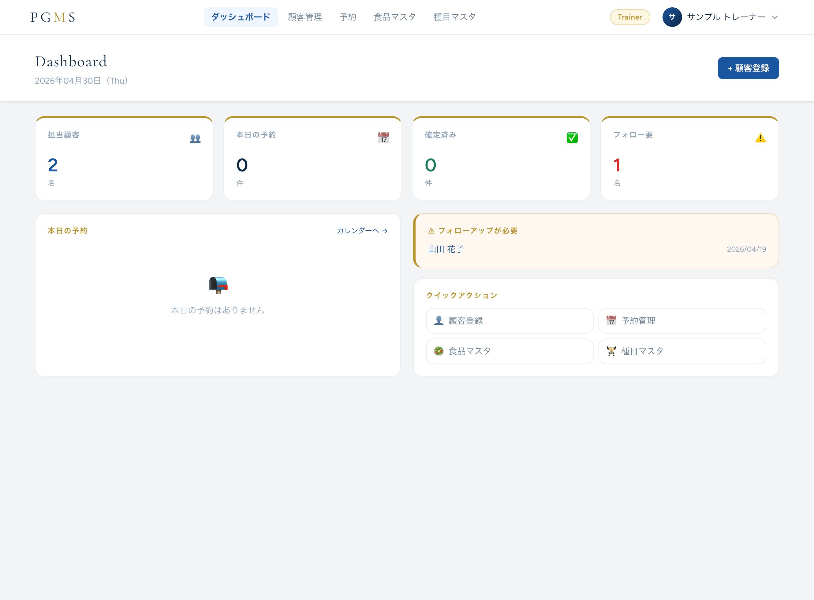
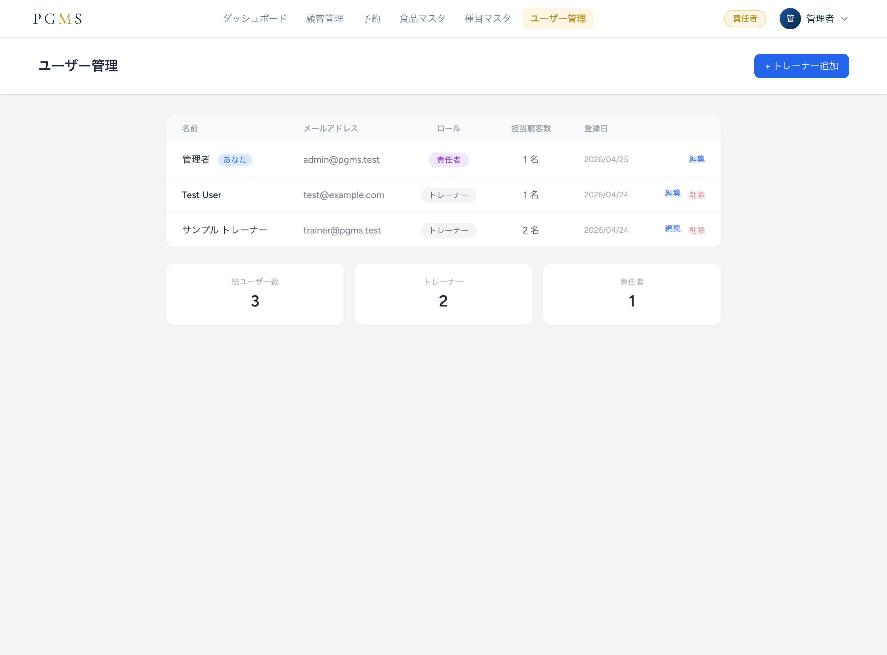
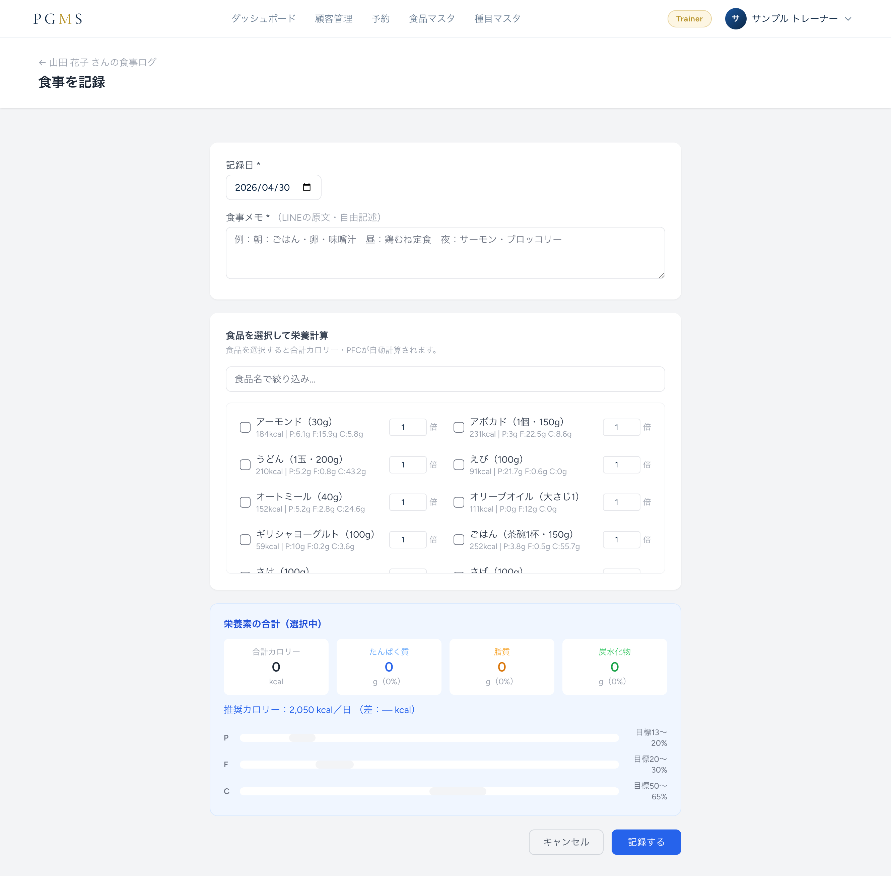
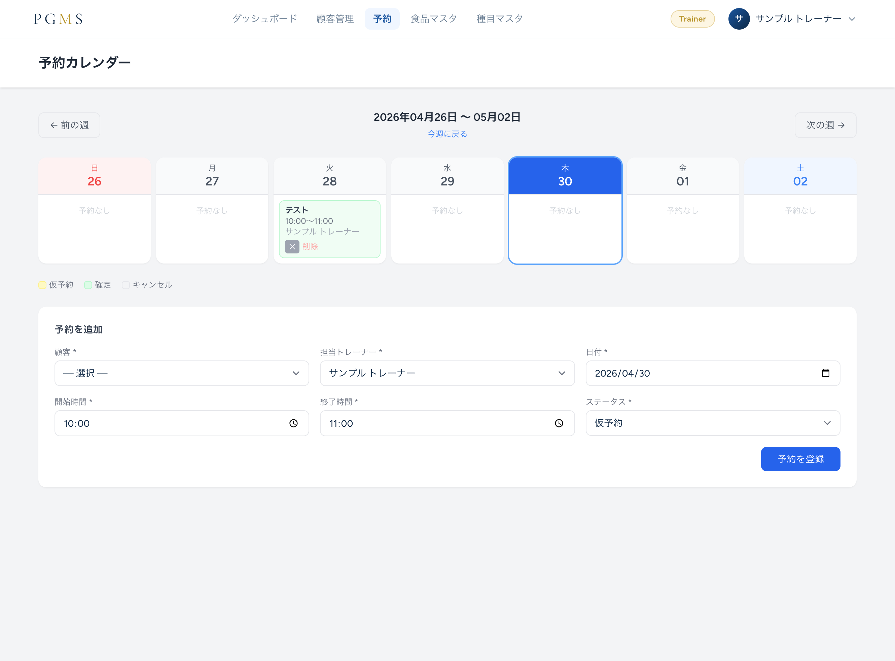

# 🏋️ GymManagement (PGMS: Personal Gym Management System)

A dedicated management application for personal gyms, designed to support evidence-based coaching and business efficiency.

The system combines detailed client progress management with customer convenience through LINE Messaging API integration.

---

## 🚀 Project Overview

This application is designed based on:

- Dietary Reference Intakes for Japanese (2025 Edition) by the Ministry of Health, Labour and Welfare
- Guidelines from the National Institute of Health and Nutrition

Rather than being just a tracking tool, the system supports scientific body transformation through automated calculations and data visualization.

Key features include:

- Automatic BMI evaluation (18.5–24.9 target range)
- PAL (Physical Activity Level) based maintenance calorie calculation (EER)
- Goal prediction based on weight change progress
- Visualized training analytics using Chart.js

---

## ✨ Main Features

### 1. 🔐 Role Management System

#### Supervisor
- Access to overall gym sales
- Manage all trainers and clients
- Full system management permissions

#### Trainer
- Manage assigned clients only
- Body measurement tracking
- Training session management
- Reservation management

#### Client
- Meal reporting through LINE
- Reservation confirmation
- Progress tracking via dedicated URL

---

### 2. 📊 Progress Tracking & Automated Calculations

#### Body Evaluation
- Automatic BMI calculation from height and weight
- Health range evaluation

#### Energy Management
- Estimated Energy Requirement (EER) calculation based on PAL

#### Predictive Progress Graphs
- Goal weight achievement prediction
- Progress visualization with Chart.js

#### Training Volume Analytics
- Visualization of:
  - Weight
  - Repetitions
  - Sets
  - Total training volume

---

### 3. 🍽 Meal & Training Records

#### LINE-integrated Meal Logging
- Extracts meal names from text
- Matches food database automatically
- Saves calorie and PFC balance data

#### Session Records
- Exercise tracking
- Weight / reps / intensity management

#### Condition Notes
- Injury history
- Physical condition
- Sleep and recovery tracking

---

### 4. 📅 Reservation Management System

* **Hybrid Reservation Flow**  
  Admin dashboard booking + LINE-based temporary reservation flow

* **Reservation Status Management**  
  `pending` (temporary) / `confirmed` / `canceled`

* **Double Booking Prevention**  
  Prevents duplicate reservations for the same trainer and time slot

* **Follow-up Management**  
  Unresponsive clients / continuation confirmation notifications

---

## 🛠 Tech Stack

| Category | Technology |
| --- | --- |
| Framework | Laravel 11.x |
| Language | PHP 8.2+, Blade |
| Infrastructure | Docker / Laravel Sail |
| Database | MySQL |
| Frontend | Tailwind CSS, Vite, Chart.js |
| API | LINE Messaging API |

---

## 📋 Database Design

Main table structure:

* `users` — Administrators & trainers (role management)
* `clients` — Client information, UUID, medical history notes
* `body_stats` — Weight, BMI, body fat percentage, etc.
* `workout_logs` — Training records
* `food_logs` — Meal logs (LINE integration)
* `reservations` — Reservation management

---

## 🔧 Setup (Laravel Sail)

### 1. Clone Repository

```bash
git clone https://github.com/itsuki3102pj22/GymManagement.git
cd GymManagement
2. Environment Setup
cp .env.example .env
composer install
./vendor/bin/sail up -d
3. Initial Setup
./vendor/bin/sail artisan key:generate
./vendor/bin/sail artisan migrate --seed

---

## 🖼 System Screenshots

### 👥 Administrator Dashboard



### 🍽 Client Food Logs



### 📅 Reservation Management



